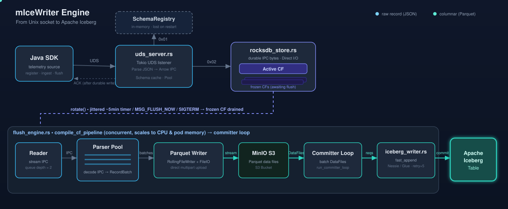

# micewriter-engine
> Part of the [mIceWriter Ingestion Ecosystem](../micewriter-hub/README.md)

Memory-safe Rust sidecar engine. Accepts telemetry records over a Unix Domain Socket, buffers them in a local RocksDB instance, and flushes them as Parquet files to an Apache Iceberg table (via Nessie REST Catalog + MinIO S3) on a jittered 10-minute cycle.

## Architecture



> The diagram above is an animated SVG (SMIL) — open it on GitHub or in a browser to watch records stream from the socket all the way to the Iceberg table.

**Flow:** the Java SDK sends framed JSON messages over a Unix domain socket to `uds_server.rs`, which registers schemas in an in-memory `SchemaRegistry` and parses incoming JSON into Arrow IPC format *before* writing to RocksDB. These IPC records are batched into the **active** RocksDB column family (`rocksdb_store.rs`). On a jittered ~5-minute cycle (or a manual `MSG_FLUSH_NOW`), `flush_engine.rs` rotates the active CF to a frozen CF and runs the `compile_cf_pipeline`: the frozen Arrow IPC records are read, decoded back into Arrow `RecordBatch` structures using a CPU-scaled parser pool, and streamed through Iceberg's native `RollingFileWriter` directly to MinIO S3. A dedicated committer loop then batches the resulting data files and commits them to the Apache Iceberg table via `iceberg_writer.rs` (`fast_append` against Nessie/Glue, with retry).

## Source Layout

| File | Responsibility |
|------|---------------|
| `main.rs` | Entry point, SIGTERM handler, emergency flush |
| `config.rs` | Env-var configuration |
| `protocol.rs` | IPC message types (`RegisterSchema`, `IngestRecord`, `AckResponse`) |
| `uds_server.rs` | Async Tokio UDS listener + JSON→IPC batch converter |
| `rocksdb_store.rs` | Active/frozen CF rotation and record append |
| `flush_engine.rs` | Jittered cron loop + `compile_cf_pipeline` (IPC→RecordBatch parser pool → Iceberg Parquet writer) + Committer loop |
| `iceberg_writer.rs` | Iceberg catalog ops (create table, `fast_append`, commit) |

## IPC Protocol

All frames use a **4-byte big-endian length prefix** followed by:

| Byte 0 | Remaining bytes | Direction |
|--------|----------------|-----------|
| `0x01` | JSON `RegisterSchema` | SDK → Engine |
| `0x02` | `IngestRecord`: `[u16 table_name_len][table_name][raw JSON bytes]` | SDK → Engine |
| *(any)* | JSON `AckResponse` | Engine → SDK |

## Environment Variables

| Variable | Required | Default | Description |
|----------|----------|---------|-------------|
| `CATALOG_TYPE` | no | `nessie` | Which catalog to use: `nessie` or `glue` |
| `MINIO_URL` | if nessie| — | MinIO S3 API base URL |
| `MINIO_ACCESS_KEY` | if nessie| — | MinIO access key |
| `MINIO_SECRET_KEY` | if nessie| — | MinIO secret key |
| `MINIO_BUCKET` | no | `iceberg` | Destination bucket |
| `NESSIE_URI` | if nessie| — | Nessie Iceberg REST catalog URI |
| `WAREHOUSE` | no | `s3://iceberg` | Iceberg warehouse path |
| `GLUE_CATALOG_ID` | no | — | AWS account ID for Glue Catalog |
| `SOCKET_PATH` | no | `/var/run/app/iceberg.sock` | UDS socket path |
| `ROCKSDB_PATH` | no | `/var/lib/rocksdb` | RocksDB data directory |
| `FLUSH_INTERVAL_SECS` | no | `300` | Base flush interval |
| `FLUSH_JITTER_SECS` | no | `60` | Random jitter added/subtracted to interval |
| `MAX_RETAINED_FROZEN_CFS` | no | `8` | Reject ingest with backpressure error once this many frozen CFs are pending flush. `0` disables. |
| `ENABLE_MANUAL_FLUSH` | no | `true` | Accepts manual flush requests via IPC socket. |
| `MALLOC_CONF` | no | `background_thread:true,dirty_decay_ms:0,muzzy_decay_ms:0` | Optional memory allocator tuning for `jemalloc`. |

## Building and Deploying

```powershell
# Build the Docker image and push it to the local k3s registry
powershell -ExecutionPolicy Bypass -File .\push.ps1
```

This is the only step needed when deploying to the k3s-on-Hyper-V home lab cluster.
`push.ps1` builds the image via Docker Desktop and pushes it to `k8s-node-1.local:5000`,
which the cluster pulls from when the `micewriter-k8s-injector` injects the sidecar.

```bash
# Native Rust build (requires Rust toolchain + C++ compiler + cmake for RocksDB)
cargo build --release

# Docker image only (no push)
docker build -t micewriter-engine:latest .
```

> **Note:** `cargo build` compiles RocksDB from C++ source on first run — expect 5–10 minutes. Subsequent builds use the cargo cache.

### Local Development via Docker (Windows Host)
If you don't have the Rust toolchain, C++ compiler, or `cmake` installed natively on your Windows host, you can leverage the existing `Dockerfile`'s builder stage to run `cargo` commands (like `cargo test` or `cargo clippy`).

First, build the development image containing all the C++ dependencies:
```powershell
docker build --target builder -t micewriter-engine-dev .
```

Then, run your `cargo` commands inside an ephemeral container, mounting your source code so you don't lose the compiled cache:
```powershell
docker run --rm -it -v ${PWD}:/app -w /app micewriter-engine-dev cargo test
```

## Integration Test (FlushNow)

`scripts/integration/flushnow-test.sh` is a black-box gRPC smoke test that verifies a
deployed engine pod responds correctly to `FlushNow`. It checks RPC plumbing only — the
async flush path (Parquet → MinIO → Nessie commit) is not asserted here.

### Prerequisites

1. **Infra up** — Nessie + MinIO running in `micewriter-infra` (via `micewriter-local-infra`):
   ```powershell
   cd ../micewriter-local-infra && pwsh ./run.ps1 up
   ```
2. **Engine deployed** — build/push the image (`push.ps1`) then install the Helm chart:
   ```bash
   helm upgrade --install engine-telemetry-events \
     ../micewriter-local-infra/charts/table-pipeline \
     --set table=telemetry_events -n micewriter-infra --wait
   ```
   The chart default `enableManualFlush=true` must be kept (it is, by default).
3. **`grpcurl` on PATH** — static binary, no dependencies:
   ```bash
   GRPCURL_VER=1.9.1
   curl -sSL "https://github.com/fullstorydev/grpcurl/releases/download/v${GRPCURL_VER}/grpcurl_${GRPCURL_VER}_linux_x86_64.tar.gz" \
     | tar -xz -C ~/.local/bin grpcurl
   ```

### Running

```bash
scripts/integration/flushnow-test.sh
```

Overridable env vars (with defaults):

| Variable | Default | Description |
|---|---|---|
| `TABLE` | `telemetry_events` | Iceberg table the engine is pinned to |
| `NAMESPACE` | `micewriter-infra` | Kubernetes namespace |
| `GRPC_PORT` | `9090` | gRPC port on the ClusterIP service |
| `LOCAL_PORT` | `9090` | Local port for `kubectl port-forward` |
| `PROTO_DIR` | auto (sibling SDK repo) | Directory containing `micewriter.proto` |

The script port-forwards `svc/engine-telemetry-events`, calls `FlushNow`, asserts
`Ack{ok: true, message: "Flush triggered"}`, then tears down the port-forward. Exit code 0 = PASS.

## Iceberg Dependency Versions

We use `iceberg-rust` v0.9+ for full native support of `fast_append` and FileIO operations without needing Python fallbacks.
